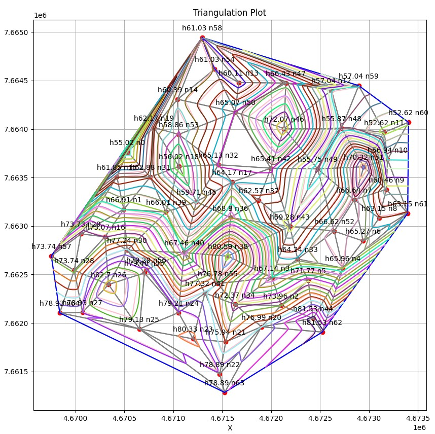
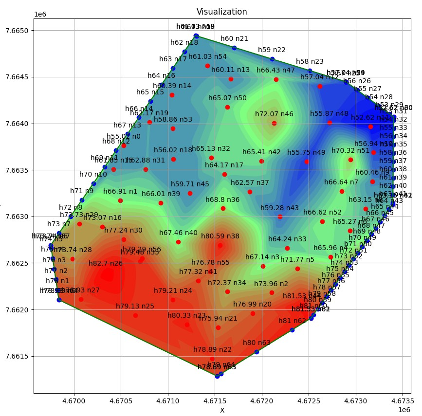

# PyTIN
This is a small library for working with irregular surfaces. The topic is quite common, but I haven't seen such a ready-made set anywhere. It allows without external dependencies:

- create a Delaunay triangulation from a set of points using a slightly optimized Bowyer-Watson algorithm (points are sorted by the X-axis, which reduces iterations);
- determine levels and draw isolines using linear interpolation;
- smooth isolines with a cubic Hermite spline using a simple method to reduce specific peaks and overlaps of the curve by changing tension;
- construct closed isocontours from smoothed and unsmoothed isolines using a method similar to the one described by Skvortsov;
visualize the result;
- other features, such as filtering triangles by minimum angle and edge length, and defining an extrapolated polygon where the vertices will be assigned the marks of the nearest points.

Triangulation, isolines, and smoothed isolines

Isocontours

Dependencies: matplotlib for visualization

The library emerged as a by-product while working on a module for engineering monitoring for nanoCAD.

References:
A.V. Skvortsov, N.S. Mirza ALGORITHMS FOR TRIANGULATION CONSTRUCTION AND ANALYSIS;
Wikipedia and search.

License: the most liberal.